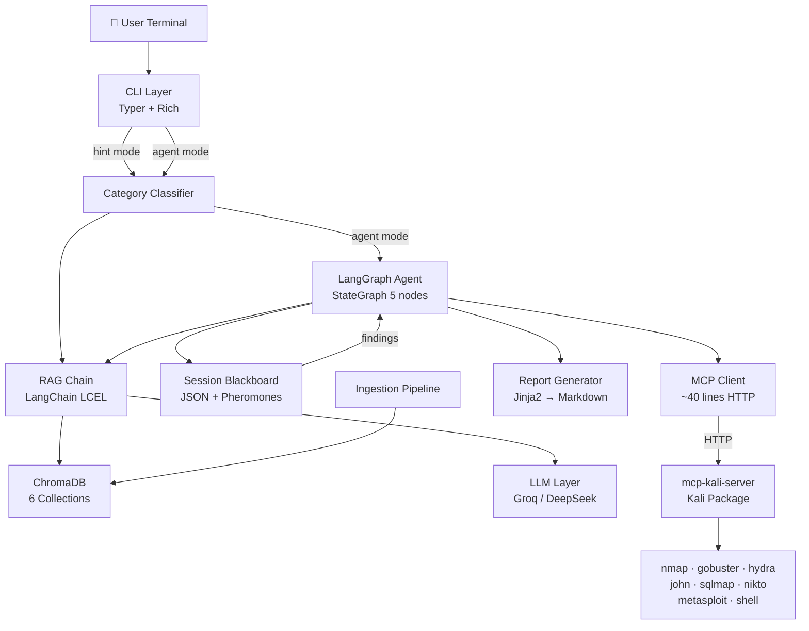

# CTF-GPT

AI-powered CTF assistant CLI featuring progressive RAG hints, a LangGraph agent, and deep Kali Linux integration via MCP.

CTF-GPT is designed to act as your pair-hacking mentor. In **Hint Mode**, it provides progressive guidance (Level 1 to Level 3) grounded in real CTF writeups to help you learn without spoiling the flag. In **Agent Mode**, it uses a LangGraph StateGraph to directly interact with Kali Linux tools (via MCP), building a pheromone-weighted evidence blackboard to give you highly contextualized advice based on actual scan results.

## Key Features

- **Progressive Hinting**: Ask for a hint and get just enough information to keep moving. Ask for a deeper level if you're still stuck.
- **Agent Mode with Kali MCP**: The assistant can run `nmap`, `gobuster`, `sqlmap`, and more directly on your Kali machine, analyzing the output to update its evidence blackboard.
- **RAG Pipeline**: Grounded in thousands of CTF writeups ingested from CTFtime, GitHub, and HackTricks.
- **Auto-Reports**: Generates a detailed Markdown report of your agent session, summarizing findings, dead ends, and executed commands.
- **Multi-LLM Support**: Built-in support for Groq (Llama 3), DeepSeek, and local Ollama deployments.

## Tech Stack

- **Language**: Python 3.11+
- **CLI Framework**: Typer & Rich
- **AI Orchestration**: LangChain & LangGraph
- **Vector Store**: ChromaDB
- **Embeddings**: Sentence Transformers (`all-MiniLM-L6-v2`)
- **System Integration**: Model Context Protocol (MCP)

## Prerequisites

- Python 3.11 or higher
- An API Key for a cloud provider:
  - Groq (`GROQ_API_KEY`) *OR*
  - DeepSeek (`DEEPSEEK_API_KEY`)
- Optional: Ollama installed (if running entirely local)
- Optional: A Kali Linux environment (for Agent Mode)

## Getting Started

### 1. Clone the Repository

If you are running this directly on your Kali Linux machine (recommended for Agent mode):

```bash
git clone https://github.com/user/ctfgpt.git
cd ctfgpt
```

### 2. Install Dependencies

It is highly recommended to use a virtual environment:

```bash
python3 -m venv .venv
source .venv/bin/activate  # On Windows: .venv\Scripts\activate
pip install -e .
```

### 3. Environment Setup

Set your API keys as environment variables. For example, using Groq:

```bash
export GROQ_API_KEY="<your_groq_api_key>"
# or for DeepSeek:
export DEEPSEEK_API_KEY="<your_deepseek_api_key>"
```

### 4. Configure CTF-GPT

By default, CTF-GPT is configured for Groq. You can verify your configuration with:

```bash
ctfgpt config --show
```

If you want to use DeepSeek instead:
```bash
ctfgpt config --set cloud.provider --value deepseek
```

### 5. Ingest Knowledge Base

Before you can ask for hints, CTF-GPT needs data. Ingest writeups from various sources:

```bash
# Ingest the latest 100 writeups from CTFtime
ctfgpt ingest --source ctftime --limit 100

# Ingest from GitHub repositories
ctfgpt ingest --source github --repos "w181496/Web-CTF-Cheatsheet" --limit 50
```

Verify your ingestion status:
```bash
ctfgpt status
```

### 6. Start Hacking! (Hint Mode)

Ask the assistant for a hint regarding a specific challenge:

```bash
# Get a Level 1 hint
ctfgpt ask "I have a PNG file but running strings shows a PK header at the top" --level 1

# If still stuck, ask for Level 3
ctfgpt ask "I have a PNG file but running strings shows a PK header at the top" --level 3
```

## Agent Mode & Kali MCP Setup

To use Agent Mode, CTF-GPT needs to communicate with Kali Linux via the Model Context Protocol (MCP).

If you cloned this repo directly onto your **Kali Linux machine**, setup is simple:

### 1. Install the MCP Server on Kali

```bash
# Install the official mcp-kali-server package (assuming it's in the apt repo)
sudo apt update
sudo apt install mcp-kali-server

# Start the server (runs on port 5000 by default)
systemctl start mcp-kali-server
```

### 2. Enable MCP in CTF-GPT

```bash
ctfgpt config --set mcp.enabled --value true
ctfgpt config --set mcp.host --value localhost
```

> **Note**: If you are running CTF-GPT on Windows and Kali in a VM, you will need to setup an SSH tunnel:
> `ssh -L 5000:localhost:5000 kali@<KALI_IP>`

### 3. Run Agent Mode

Once connected, ask the agent to investigate:

```bash
ctfgpt ask "The target is 10.10.11.230. Start recon." --agent
```

The agent will autonomously plan its approach, but **will prompt you for approval before executing each command** on Kali. 

Once you approve, it executes the tool (like `nmap`), reads the output, updates its evidence blackboard, and repeats the cycle until it has enough evidence to provide you with a grounded hint. 

After the session, view the generated report:
```bash
ctfgpt report
```

## Architecture

### Directory Structure

```text
ctfgpt/
├── ctfgpt/
│   ├── agent.py          # LangGraph StateGraph definition
│   ├── blackboard.py     # Pheromone-weighted evidence tracker
│   ├── classifier.py     # Auto-detects CTF categories (web, pwn, etc.)
│   ├── cli.py            # Typer CLI entrypoints
│   ├── config.py         # Configuration & LLM instantiation
│   ├── mcp_client.py     # Thin HTTP wrapper for Kali MCP server
│   ├── rag.py            # LangChain LCEL Retrieval logic
│   ├── report.py         # Jinja2 markdown report generator
│   └── utils/
│       ├── history.py    # Session history management
│       ├── rich_output.py# Terminal styling and UI
│       └── safety.py     # Command validation and scope enforcement
├── ingestion/
│   ├── chunker.py        # Semantic chunking and metadata tagging
│   ├── embedder.py       # ChromaDB insertion logic
│   ├── loader_github.py  # GitHub writeup loader
│   ├── loader_pdf.py     # PDF writeup loader
│   ├── scraper_ctftime.py# CTFtime web scraper
│   └── scraper_hacktricks.py # HackTricks wiki loader
├── config.yaml           # Default configuration
└── pyproject.toml        # Project metadata and dependencies
```

### Data Flow



## Available Commands

| Command | Description |
|---------|-------------|
| `ctfgpt ask "query"` | Ask for a hint or trigger the agent (with `--agent`) |
| `ctfgpt solve <target>` | Run a structured category-aware attack playbook |
| `ctfgpt plan <target>` | Generate and execute an adaptive LLM-driven attack plan |
| `ctfgpt auto <target>` | Run the autonomous Multi-Agent System (Router + Sub-Agents) |
| `ctfgpt ingest` | Populate the vector database from various sources |
| `ctfgpt status` | Check DB stats, LLM connectivity, and MCP status |
| `ctfgpt config` | View or modify the configuration |
| `ctfgpt history` | View a table of past sessions |
| `ctfgpt report` | Generate and view a markdown report of an agent session |
| `ctfgpt tools` | List all tools currently available via the Kali MCP server |

## Solve Mode

`ctfgpt solve` is a smarter, more opinionated alternative to `--agent`. Instead of letting the LLM freely decide what to run, it executes a **pre-defined playbook** of the best tools for each CTF category, in the optimal order.

### Playbooks by Category

| Category | Tools Executed (in order) |
|----------|---------------------------|
| `web` | curl headers → nikto → gobuster → robots.txt → source hints |
| `forensics` | file → strings → xxd → binwalk → exiftool → steghide |
| `pwn` | file → checksec → strings → nm → objdump → ltrace |
| `reversing` | file → strings → readelf → nm → objdump → anti-debug check |
| `crypto` | base64 decode → hex decode → ROT13 → Caesar brute → hashid |
| `osint` | whois → nslookup → curl headers → gobuster dns → openssl cert |

### Examples

```bash
# Web target — auto-detects category, runs web playbook
ctfgpt solve http://10.10.11.230

# Force forensics category on a file
ctfgpt solve /home/kali/ctf/mystery.png --category forensics

# Crypto challenge — brute-force common encodings
ctfgpt solve "KHOOR ZRUOG" --category crypto

# Preview all planned steps without executing
ctfgpt solve 10.10.11.230 --dry-run

# Run only the first 3 steps
ctfgpt solve 10.10.11.230 --max-steps 3
```

## Plan Mode

`ctfgpt plan` is the most intelligent attack mode. Unlike `solve` (static playbook) or `--agent` (open-ended), it asks the LLM to **generate a concrete attack plan first**, shows it to you, then executes step by step with **adaptive re-planning** after each tool output.

### How It Works

1. **Plan Generation** — LLM creates a numbered attack plan based on your target, category, and RAG context
2. **User Approval** — Full plan displayed in a table for review before execution
3. **Adaptive Execution** — After each step, the LLM evaluates the output and can:
   - `CONTINUE` — proceed to the next step
   - `INSERT` — add an urgent new step (e.g., update `/etc/hosts` after a redirect)
   - `REPLAN` — revise the entire remaining plan based on new evidence
   - `DONE` — stop early if the flag is found
4. **Final Summary** — RAG-grounded solution summary from all evidence

### Examples

```bash
# Web target with adaptive planning
ctfgpt plan 10.10.11.230 --category web

# Let it auto-detect category from description
ctfgpt plan "WordPress site at smol.thm with vulnerable plugins"

# Interactive mode (prompts for target)
ctfgpt plan
```

## Auto Mode

`ctfgpt auto` unleashes the Multi-Agent System. Instead of a single agent doing everything, the system spins up specialized sub-agents:
- **Router**: Analyzes the evidence and delegates tasks to the best sub-agent
- **Recon Agent**: Focused entirely on safe enumeration (nmap, gobuster, etc.)
- **Exploit Agent**: Focused on gaining initial access (sqlmap, msfconsole, etc.)
- **PrivEsc Agent**: Focused on local privilege escalation to root (linpeas, sudo, etc.)

Each agent runs its own ReAct loop with a strictly enforced whitelist of allowed tools. They share state through a unified Blackboard.

### Examples

```bash
ctfgpt auto 10.10.11.230
```

## Troubleshooting

### LLM Connection Fails
**Error:** `ctfgpt status` shows LLM disconnected.
**Solution:** Ensure your API key is correctly exported in your terminal session (`echo $GROQ_API_KEY`). Ensure your `ctfgpt config --show` is pointing to the correct provider.

### MCP Connection Refused
**Error:** Agent mode fails or `ctfgpt status` shows MCP disconnected.
**Solution:** Ensure the `mcp-kali-server` is running on the target machine. Check that `config.mcp.host` is correct. If running across VMs, ensure the firewall allows port 5000 or your SSH tunnel is active.

### ChromaDB Errors during Ingestion
**Error:** SQLite or ChromaDB throws operational errors.
**Solution:** This can sometimes happen due to mismatched SQLite versions. The database is stored at `~/.ctfgpt/db`. If it becomes corrupted, you can safely delete this folder and re-run `ctfgpt ingest`.
